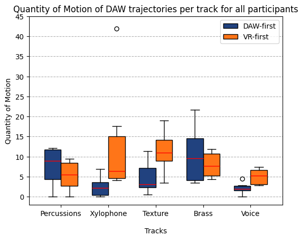
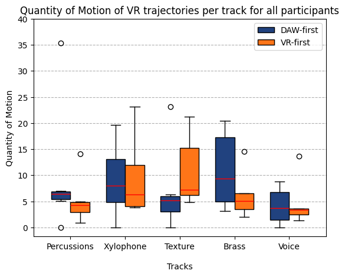
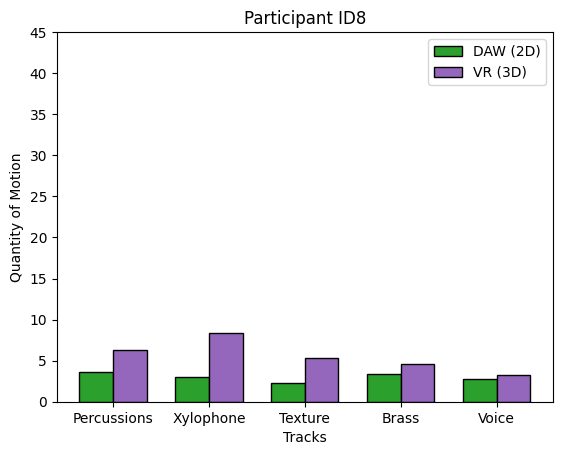
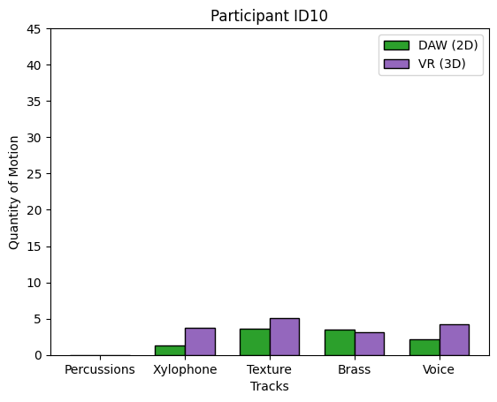

# Plots

<!--  -->

### Quantity of motion across experiment conditions, and divided between daw-first and vr-first participants

### Quantity of motion across one experiment condition and for different tracks
#### Condition: DAW (2D)  

#### Condition: VR (3D)  

### Per participant

